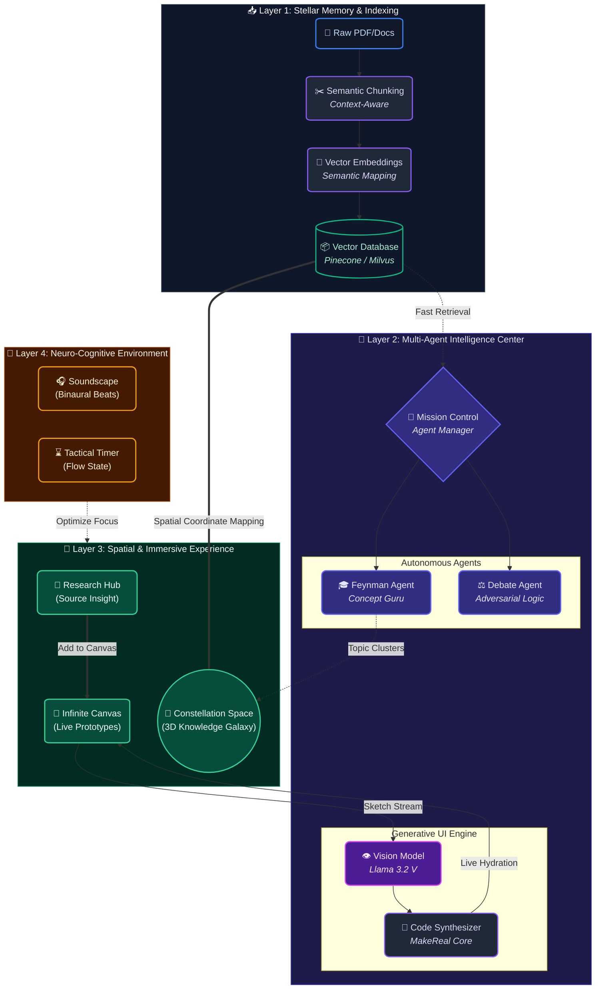

  
  <h1>🌌 AstraPath: The Spatial Cognitive Engine</h1>
  
<strong>Không gian tư duy đa chiều cho thế hệ Gen Z</strong>

  
  
  
  
  

  
<em>Sản phẩm tâm huyết tham dự <strong>AI Young Guru 2026</strong> - Từ <strong>Team Mì Hảo Hảo</strong></em>

---

## 🛑 1. Tại sao chúng em làm AstraPath? (Câu chuyện của Team)

Kính thưa Ban Giám Khảo,

Là những học sinh lớp 12 đang đứng trước ngưỡng cửa Đại học, chúng em thấm thía cảnh "ngộp thở" giữa biển kiến thức.

Cách chúng em học hiện nay vẫn rất rời rạc: Hàng chục file PDF nằm chết trong thư mục `Downloads`. Khi bí bài, chúng em hỏi ChatGPT, nhưng nó thường xuyên "ảo giác" (bịa công thức Lý, sai kiến thức Sử) khiến việc ôn tập rất hoang mang. Chúng em nhận ra mình đang trở thành những thợ gõ prompt thụ động thay vì thực sự tư duy.

**AstraPath ra đời từ chính nỗi đau đó.** Chúng em không muốn làm một con chatbot thông minh hơn. Chúng em muốn xây dựng một "bàn học số" - nơi kiến thức không phải là những dòng chữ vô hồn, mà là những vật thể có thể chạm, nắm và kết nối được.

---

## 🌟 2. Triết lý thiết kế (Cách chúng em tiếp cận)

Thay vì giao diện chat 2D truyền thống nhàm chán, AstraPath đưa người dùng vào một **Không gian 3D (Spatial Ecosystem)**. 

Sức mạnh của dự án nằm ở sự kết hợp của 3 công nghệ mà chúng em đã mày mò tích hợp:
1.  **Hybrid-Edge RAG:** Để cân bằng giữa bảo mật và tốc độ, chúng em dùng Hybrid-Edge RAG. Việc băm nhỏ tài liệu (Chunking) và tạo Vector (Embedding) bằng `transformers.js` diễn ra **cục bộ 100% trên trình duyệt (Edge)** để bảo vệ dữ liệu cá nhân. Nhưng khâu suy luận nặng (Inference) được đẩy qua **Groq LPU** để có tốc độ phản hồi < 500ms.".
2.  **Generative UI:** Biến nét vẽ tay nguệch ngoạc thành code thật.
3.  **Interactive WebGL:** Biến dữ liệu khô khan thành các "hành tinh" trôi trong không gian.

### 🧠 Trái tim của hệ thống: Chúng em đã dùng những công cụ AI nào?
Để hiện thực hóa sơ đồ trên, thay vì dùng một mô hình duy nhất, chúng em đã thiết kế một hệ thống **Multi-Model (Đa mô hình)** để tối ưu chi phí và tốc độ:
*   **Groq LPU & Llama 3.2 (Mã nguồn mở):** Dùng làm "bộ não" chính cho các Agent (Feynman, Debate). Groq cho tốc độ phản hồi tính bằng mili-giây, giúp trải nghiệm chat mượt như đang nói chuyện thật.
*   **Llama 3.2 Vision (AI Thị giác):** Đóng vai trò "đôi mắt" trong tính năng MakeReal, giúp đọc hiểu nét vẽ tay và bố cục của người dùng trên bảng vẽ.
*   **Nomic-Embed-Text / OpenAI Text-Embedding:** `GTE-multilingual` Dùng để mã hóa tài liệu PDF thành các vector (Vector Embeddings) đưa vào cơ sở dữ liệu.
*   **Thuật toán Edge RAG tự xây dựng:** Toàn bộ quy trình Truy xuất - Tăng cường - Tạo sinh (RAG) được chúng em tinh chỉnh để chạy trực tiếp, đảm bảo 100% không bịa đặt thông tin (Zero-hallucination).

**🔄 Quy trình người dùng cơ bản:**
`Tải file PDF lên` ➡️ `AI tự động băm nhỏ & lưu trữ (Vector hóa)` ➡️ `Người dùng đặt câu hỏi / Vẽ ý tưởng` ➡️ `Hệ thống trích xuất đúng dòng tài liệu` ➡️ `Llama 3.2 tổng hợp câu trả lời & hiển thị trên không gian 3D`.

---

## 🛠️ 3. "Bên dưới nắp ca-pô": Triết lý kiến trúc của AstraPath

Để có được sự mượt mà và trực quan như trong các video demo, Team Mì Hảo Hảo đã dành trọn gần 1 tuần "ăn ngủ" cùng các sơ đồ kiến trúc và các dự án nghiên cứu. Chúng em hiểu rằng: **Một công cụ AI mạnh không chỉ nằm ở Model, mà nằm ở cách các luồng dữ liệu tương tác với não bộ con người.**

Dưới đây là sơ đồ "tổng hành dinh" của AstraPath - nơi chúng em kết hợp giữa sức mạnh thuật toán và khoa học thần kinh:

### 🏮 Triết lý 4 tầng của chúng em:

1.  **Tầng 1 - Stellar Memory (Trí nhớ vĩnh cửu):** Chúng em không chỉ lưu trữ file. Dữ liệu được "băm nhỏ" theo ngữ nghĩa (Semantic Chunking) và lưu vào Vector Database. Đây là cách chúng em loại bỏ hoàn toàn sự "ảo giác" của AI – mọi câu trả lời đều phải có "gốc rễ" từ dữ liệu này.
2.  **Tầng 2 - Multi-Agent (Hội đồng đặc vụ):** Thay vì một AI làm mọi việc, chúng em chia ra các **"Chuyên gia độc lập"**. *Feynman Agent* lo việc giảng giải, *Debate Agent* lo việc phản biện, còn *Vision Model* đóng vai trò đôi mắt để đọc bản vẽ tay của người dùng.
3.  **Tầng 3 - Spatial Experience (Trải nghiệm Không gian):** Đây là nơi công nghệ WebGL tỏa sáng. Kiến thức không còn nằm trong danh sách (List), nó nằm trong các chòm sao. Mọi thứ chúng em Render đều hướng tới việc giúp não bộ "nhìn" thấy cấu trúc của sự hiểu biết.
4.  **Tầng 4 - Neuro-Cognitive (Bảo hộ tâm trí):** Tầng cuối cùng là sự quan tâm của chúng em dành cho sức khỏe tinh thần. Sóng não Binaural và Tactical Timer được tích hợp sâu để đảm bảo người dùng đạt trạng thái **Flow (Dòng chảy)** nhanh nhất và ở lại đó lâu nhất.

**Chúng em tin rằng: Một hệ thống AI tốt không thay thế bộ não con người, mà phải trở thành một "bộ xương ngoài" (Exoskeleton) nâng đỡ cho trí tuệ con người.**

---

### 🎯 4. AstraPath dành cho ai?

Thực tế, chúng em xây dựng AstraPath đầu tiên là để... cứu lấy chính mình và các bạn đồng trang lứa.

#### 🧑‍🚀 4.1. Sĩ tử cuối cấp (Như chúng em)
*   **Vấn đề:** Quá tải kiến thức Toán, Lý, Anh... trong giai đoạn nước rút. Học trước quên sau.
*   **Nhiệm vụ:** Hệ thống hóa toàn bộ chương trình học, ghi nhớ các công thức phức tạp và duy trì sự tập trung cao độ trong giai đoạn nước rút.
*   **Giải pháp AstraPath:** 
    *   Biến mỗi môn học thành một **Chòm sao tri thức** riêng biệt. 
    *   Sử dụng *Feynman Mode* để tự giảng lại các định lý khó (như Lượng tử ánh sáng hay Sóng cơ).
    *   Dùng *Neuro-Acoustic* (Sóng Alpha) để học bài đêm mà không bị xao nhãng bởi mạng xã hội.
    *   *Flashcards & Mindmap* tự động giúp ôn tập (Active Recall) nhanh gấp 3 lần bình thường.

#### 🎓 4.2. Sinh viên & Người làm nghiên cứu
*   **Bối cảnh:** Luận văn, đồ án và các công trình nghiên cứu khoa học với hàng trăm nguồn tài liệu tiếng Anh.
*   **Nhiệm vụ:** Trích xuất thông tin chính xác, quản lý tài liệu tham khảo và brainstorm hướng phát triển đề tài.
*   **Giải pháp AstraPath:** *Source Insight* giúp trích dẫn minh bạch, loại bỏ hoàn toàn sai sót trong nghiên cứu học thuật.

#### 💼 4.3. Những nhà lãnh đạo & Quản lý chiến lược
*   **Bối cảnh:** Những "phòng tác chiến" (War-rooms) của doanh nghiệp với những bản kế hoạch kinh doanh dày đặc.
*   **Nhiệm vụ:** Phân tích dữ liệu, kết nối các chỉ số thị trường và tìm ra cơ hội đột phá.
*   **Giải pháp AstraPath:** Khả năng liên kết các "Ngôi sao tri thức" giúp nhìn thấy bức tranh toàn cảnh (Big Picture) của doanh nghiệp.

---

## 🛸 5. Trạm Không Gian AstraPath (Demo Tính Năng)

Thay vì nói những lời hoa mỹ, chúng em xin mời Ban Giám Khảo xem những gì team đã thực sự code được.

### 🌌 5.1. Constellation Space: Vũ trụ Tri thức 3D

Chúng em không muốn hiển thị danh sách file như Windows Explorer. Trong AstraPath, mỗi chủ đề học tập là một ngôi sao.

  <video controls src="https://github.com/user-attachments/assets/588e20c9-47df-438f-8a8c-f7821d77af44"></video>
  
<em>Kéo thả kiến thức như Iron Man trong phòng lab.</em>

*   **Chữ ký Ánh sao (Star Signature):** Chúng em không muốn nhìn vào một vũ trụ toàn những chấm tròn vô hồn giống hệt nhau. AstraPath cho phép người dùng **vẽ tay trực tiếp lên bề mặt ngôi sao** để đánh dấu chủ quyền. Thử tưởng tượng: Vẽ một hình trái tim cho bài thơ tình Xuân Diệu, một tia sét cho chương Điện xoay chiều, hay đơn giản là vẽ... mặt mếu cho bài chưa thuộc. Nó biến không gian học tập thành nơi "chính chủ", nhìn lướt qua là nhận ra ngay bài nào là bài nào.
*   **Tương tác vật lý:** Khi kéo các "ngôi sao" lại gần nhau, não bộ sẽ hình thành tư duy liên kết (Semantic Mapping) tốt hơn nhiều so với việc click chuột vào thư mục.
*   **Vệ tinh ghi nhớ:** Một vệ tinh nhỏ sẽ luôn bay quanh bài học gần nhất. Mở máy lên là biết ngay hôm qua mình đang học dở bài nào, không cần lục tìm.
*   **Hố đen:** Muốn xóa file? Kéo nó vào hố đen. Hiệu ứng hạt (particles) nổ tung tạo cảm giác giải tỏa căng thẳng rất đã mắt.

### 🎯 5.2. Chống "Ảo giác": Zero-Hallucination Edge RAG

Đây là tính năng chúng em tự hào nhất. Khi hỏi bài, AI sẽ trả lời và gắn số `[1]`, `[2]`. Bấm vào số đó, tài liệu gốc sẽ hiện ra và **bôi đậm (highlight)** đúng dòng chứa thông tin. 

  <video controls src="https://github.com/user-attachments/assets/5f8105e4-0722-40bc-bc35-c5d48878554d"></video>
  
<em>Không sợ AI "chém gió" sai kiến thức nữa.</em>

### 🎙️ 5.3. Hai chế độ học sâu (Deep Learning)

Chúng em thiết kế 2 "nhân cách" cho AI để việc học bớt buồn chán:

#### 🟢 Feynman Mode (Đóng vai thầy giáo)
Học theo phương pháp của Richard Feynman: *"Nếu bạn không giải thích được cho người khác hiểu, nghĩa là bạn chưa hiểu."*
*   **Cách chơi:** Em sẽ giảng bài lại cho AI.
*   **Kết quả:** AI sẽ chấm điểm xem em hiểu đúng chưa, còn hổng chỗ nào.

  

#### 🔴 Debate Mode (Đóng vai "Kẻ khó tính")
*   **Cách chơi:** AI sẽ liên tục phản bác luận điểm của em, ép em phải tìm dẫn chứng để bảo vệ quan điểm.
*   **Mục tiêu:** Rèn luyện tư duy phản biện (Critical Thinking) cực tốt cho các bài thi luận.

  

### 🪄 5.4. MakeReal: Vẽ là có Prototype
Tính năng này giúp chúng em hiện thực hóa ý tưởng cực nhanh. Vẽ một ý tưởng nảy ra trong đầu, AI nhận diện hình ảnh và tạo giao diện ngay lập tức.

  <video controls src="https://github.com/user-attachments/assets/d953f00a-2fd0-4f47-b5ee-1e08008d7fae"></video>

### 🎧 5.5. Soundscape: Âm thanh cho sự tập trung
Thú thật là chúng em rất khó tập trung khi có tiếng ồn, nhưng bật nhạc lời thì lại hay hát theo. AstraPath tích hợp sẵn bộ mixer âm thanh khoa học:
*   **Sóng Alpha:** Giúp tỉnh táo nhẹ nhàng để học thuộc lòng.
*   **Sóng Beta:** Tăng tốc độ xử lý khi giải Toán/Lý.
*   **White Noise:** Tiếng mưa, tiếng lửa trại để át tiếng ồn xung quanh.

  
  <video controls src="https://github.com/user-attachments/assets/58b93a2c-d893-4dda-b65e-496c538bb7d4"></video>

### 🪄 5.6. Trích xuất Tri thức tức thời (Selection-to-Canvas)

Trong quá trình ôn thi, chúng em nhận ra một "nỗi khổ": Mỗi lần thấy một ý hay trong tài liệu, chúng em lại phải Ctrl+C, Ctrl+V rồi chuyển giữa 2 mode rất mất thời gian, làm đứt đoạn mạch tư duy (Flow state). 

Vì vậy, chúng em đã phát triển tính năng **"Highlight để chiếm lĩnh"**:

*   **Cơ chế:** Ngay khi Ban Giám Khảo bôi đen (select) một câu trả lời của AI hoặc một đoạn văn bản bất kỳ trong tài liệu gốc, một nút **"Add to Canvas"** sẽ xuất hiện ngay lập tức tại vị trí con trỏ.
*   **Kết quả:** Chỉ với một cú click, đoạn thông tin đó sẽ được "bắn" thẳng ra bảng vẽ (Canvas Mode) dưới dạng một thẻ kiến thức độc lập.
*   **Giá trị:** Chúng em không còn phải gõ lại hay copy-paste thủ công. Việc nhặt những ý quan trọng từ hàng trăm trang tài liệu để đưa vào sơ đồ tư duy giờ đây diễn ra chỉ trong vài giây, giúp việc tổng hợp kiến thức trở nên mượt mà và đầy cảm hứng.

  <video controls src="https://github.com/user-attachments/assets/742cc2b9-23a8-41b8-a55e-5d6dbe056022"></video>
  
<em>Một cú chạm để biến văn bản tĩnh thành thực thể tư duy trên Canvas.</em>

### 🧠 5.7. AI Flashcards: "Khắc nhập" kiến thức vào trí nhớ dài hạn

Học nhanh thôi là chưa đủ, mục tiêu cuối cùng của chúng em là phải **nhớ lâu**. Nhưng việc ngồi tự tay chép lại từng tấm thẻ ghi nhớ (Flashcard) là một cực hình khi kỳ thi đã cận kề. 

AstraPath giải quyết điều này bằng hệ thống Flashcards thông minh, hoạt động dựa trên phương pháp **Active Recall** (Gợi nhớ chủ động):

*   **Tự động hóa hoàn toàn:** Chỉ cần một nút bấm, AI sẽ tự quét toàn bộ tài liệu và "chiết xuất" ra những bộ thẻ hỏi-đáp quan trọng nhất. Những công thức Lý khó nhằn hay các mốc lịch sử sẽ tự động được hệ thống hóa.
*   **Linh hoạt tối đa:** Chúng em tin rằng AI không bao giờ thay thế được tư duy con người. Vì vậy, người dùng có thể tự do chỉnh sửa nội dung AI tạo ra hoặc **thêm thủ công** những "mẹo" ghi nhớ riêng của bản thân.
*   **Nút bấm "Tại sao?":** Đây là điểm tinh tế nhất. Đôi khi AI tạo ra câu trả lời quá ngắn gọn khiến chúng em không hiểu bản chất. Thay vì phải đi copy lại để hỏi AI, chúng em chỉ cần bấm nút **"Explain"**. 
*   **Kết nối liền mạch:** Ngay lập tức, nội dung thẻ đó sẽ được "ném" vào ô chat, và AI sẽ giải thích cặn kẽ lại vấn đề đó như một gia sư riêng, giúp chúng em chuyển từ **Ghi nhớ vẹt** sang **Thấu hiểu sâu**.

  <video controls src="https://github.com/user-attachments/assets/44461c40-9759-44bc-8338-6a86cb4f2b50"></video>
  
<em>Khi ghi nhớ gặp gỡ sự thấu hiểu: Biến những thông tin khô khan thành phản xạ tự nhiên.</em>

---

## 📈 6. AstraPath trong đời thực: Không chỉ là lý thuyết

AstraPath không phải là một dự án "nằm trên giấy". Chúng em đã đưa hệ thống vào thử nghiệm thực tế với chính mình và các nhóm nhỏ người dùng thử để đo lường giá trị mà nó mang lại:

1.  **Với Sĩ tử cuối cấp (Như chúng em):** 
    *   **Tiết kiệm 80% thời gian tra cứu:** Thay vì lật từng trang sách hay tìm file PDF mỏi mắt, chúng em chỉ cần hỏi và AI sẽ chỉ đích danh đoạn văn cần đọc. 
    *   **Vượt qua "nỗi sợ" học đêm:** Chế độ *Neuro-Acoustic* kết hợp với *Feynman Mode* đã giúp các bạn trong team em giữ được sự tỉnh táo và hiểu sâu các bài tập khó (như Lượng tử ánh sáng) ngay cả sau 11 giờ đêm mà không cần lạm dụng caffeine.

2.  **Với Sinh viên & Nghiên cứu sinh:**
    *   **Nói không với sai sót trích dẫn:** Tính năng *Source Insight* giúp các anh chị sinh viên khóa trên mà chúng em nhờ dùng thử cảm thấy "nhẹ đầu" hơn hẳn khi viết tiểu luận. Việc mở thẳng tài liệu gốc để kiểm chứng giúp loại bỏ hoàn toàn nỗi lo bị AI "dắt mũi" bằng thông tin giả.
    *   **Quản lý hàng trăm nguồn tin:** Không còn cảnh lạc lối trong thư mục, mọi tài liệu đều được sắp xếp thành các chòm sao, giúp việc kết nối các luận điểm nghiên cứu trở nên trực quan như một bản đồ tư duy.

3.  **Với các Nhà lãnh đạo & Nhà sáng lập trẻ:**
    *   **Nhìn thấy "Bức tranh toàn cảnh" (Big Picture):** Khả năng liên kết các ngôi sao tri thức giúp người quản lý không bị sa lầy vào tiểu tiết mà thấy được sự liên quan giữa các chỉ số thị trường hay kế hoạch kinh doanh.
    *   **Từ ý tưởng đến thực tế trong vài phút:** Tính năng *MakeReal* đã thực sự gây "WOW". Chúng em đã thử phác thảo nhanh một giao diện ứng dụng quản lý lớp học và thấy AI Render ra code chỉ sau chưa đầy 30 giây – tiết kiệm hàng tuần lễ chờ đợi thiết kế và lập trình mẫu.

### 💎 Điểm khác biệt cốt lõi (Tự hào của AstraPath)
Nếu phải so sánh với các công cụ hiện tại như ChatGPT hay Notion AI, AstraPath của chúng em giải quyết triệt để 3 điểm yếu chí mạng:
1.  **Chống Ảo giác tuyệt đối (100% Transparency):** ChatGPT có thể bịa ra một định lý Vật lý. AstraPath thì không. Chúng em buộc AI phải trích dẫn ngược lại đúng dòng, đúng trang trong tài liệu gốc (Source Insight).
2.  **Từ 2D phẳng lên 3D Không gian (Spatial UI):** Không còn là những dòng chat trôi tuột đi mất. Kiến thức được neo giữ dưới dạng các "Chòm sao" trong không gian 3D, giúp não bộ ghi nhớ theo phương pháp định vị không gian (Method of Loci).
3.  **Thay đổi trạng thái não bộ (Neuro-Acoustic):** Không có công cụ AI nào hiện nay quan tâm đến sóng não người dùng. AstraPath tích hợp Binaural Beats để chủ động ép não bộ vào trạng thái tập trung sâu (Flow State).

**Tóm lại:** AstraPath không chỉ giúp chúng em học tốt hơn, nó đang định hình lại cách chúng em tư duy, làm việc và hiện thực hóa những ý tưởng sơ khai nhất.

---

## 🛰️ 7. Lộ trình "Vươn tới những vì sao" (Mission Roadmap 2026+)

AstraPath không dừng lại ở một bản mẫu dự thi. Đối với Team Mì Hảo Hảo, đây là khởi đầu của một hành trình dài hạn. Chúng em đã vạch ra lộ trình để biến "Trạm không gian" này thành một hệ sinh thái thực thụ:

#### 👨‍🚀 7.1. Chế độ Phi hành đoàn (Multiplayer Mission Control)
*   **Tầm nhìn:** Biến AstraPath thành một "Phòng tác chiến số" (Digital War Room) thực thụ.
*   **Dự kiến:** Chúng em không chỉ dừng lại ở việc học chung, mà là **cùng nhau giải quyết vấn đề**. 
    *   **Phân vai nhiệm vụ:** Trong một dự án nhóm, mỗi bạn sẽ được cấp quyền quản lý một "Chòm sao" riêng. Bạn nhóm trưởng có thể ghim (pin) các đầu việc trực tiếp lên các ngôi sao tri thức.
    *   **Tương tác thời gian thực:** Hãy tưởng tượng Ban Giám Khảo đang họp chiến lược, mọi người cùng làm việc, cùng kéo thả các ý tưởng, chia sẻ tài liệu và thấy con trỏ của nhau di chuyển trong không gian vũ trụ. 
    *   **Giá trị:** Loại bỏ sự rời rạc của các ứng dụng chat. Mọi cuộc thảo luận đều nằm ngay cạnh kiến thức, giúp việc ra quyết định nhanh và chính xác hơn bao giờ hết.

#### 📄 7.2. Khung Tổng hợp Chiến lược (Strategic Synthesis Frame)
*   **Tầm nhìn:** Biến những ý tưởng "ngổn ngang" trên Canvas thành thành phẩm chuyên nghiệp.
*   **Dự kiến:** Một trong những khâu mệt mỏi nhất là sau khi Brainstorming xong, chúng em phải ngồi gõ lại báo cáo. AstraPath sẽ có tính năng **Smart Frame**:
    *   **Cơ chế:** Người dùng chỉ cần vẽ một cái khung bao quanh các thực thể (ngôi sao, ghi chú, hình vẽ tay) trên Canvas. 
    *   **Sức mạnh AI:** AI sẽ ngay lập tức phân tích mối quan hệ giữa các đối tượng đó, hiểu được logic của người dùng và xuất ra một **Bản báo cáo chi tiết** hoặc một **Bảng phân tích chuyên sâu** dưới dạng PDF/Excel.
    *   **Giá trị:** "Phù phép" sự lộn xộn của sáng tạo thành sự ngăn nắp của chuyên môn. Từ một bản vẽ nháp, bạn có ngay một bản kế hoạch hành động hoặc một bài tiểu luận hoàn chỉnh chỉ trong một cú nhấp chuột.

#### 📊 7.3. Cognitive Analytics Dashboard (Trạm Phân tích Nhận thức)
*   **Tầm nhìn:** Biến dữ liệu thô thành "Chỉ số thông minh" cá nhân hóa.
*   **Tính năng:** Hệ thống AI tự động phân tích hành vi học tập:
    *   *Deep Work Heatmap:* Xác định khoảng thời gian người dùng tập trung cao nhất trong ngày.
    *   *Acoustic Preference:* Phân tích xem loại sóng não nào (Alpha/Beta/Theta) mang lại hiệu quả ghi nhớ tốt nhất cho từng cá nhân.
    *   *Knowledge Metabolism:* Đo lường tốc độ tiêu hóa tài liệu và dự đoán thời điểm người dùng bắt đầu quên kiến thức để nhắc nhở ôn tập (Spaced Repetition).

#### 🎨 7.4. Community Constellation Marketplace
*   **Tầm nhìn:** Dân chủ hóa kho tri thức chất lượng cao.
*   **Tính năng:** Một "chợ" ứng dụng nơi các chuyên gia, giáo viên có thể chia sẻ hoặc bán các **"Cấu trúc Chòm sao"** (các sơ đồ tư duy và tài liệu đã được tối ưu hóa) cho các lĩnh vực khó như Y khoa, Lập trình cấp cao, hay Ngôn ngữ hiếm.

---

## 🔬 8. Cơ sở khoa học

Chúng em không code bừa. Mọi tính năng đều dựa trên những nghiên cứu tâm lý giáo dục mà team đã tìm hiểu:
*   **[1] Sweller, J. (1988):** *Cognitive Load Theory*.  nền tảng cho cách AstraPath giảm tải thông tin thừa trên UI để tối ưu hóa việc học sâu.
*   **[2] Maguire, E. A., et al. (2003):** *Neural correlates of the method of loci*. Nghiên cứu cho thấy khi sử dụng phương pháp loci (ghi nhớ dựa trên không gian và tuyến đường), hoạt động ở vùng hippocampus tăng lên, gợi ý vai trò mạnh mẽ của hệ thống định vị không gian trong ghi nhớ. Đây là nền tảng thần kinh cho việc dùng không gian 3D (Constellation Space) để tổ chức tri thức.
*   **[3] Moser, M. B., et al. (2008):** *Place cells, grid cells, and the brain's spatial representation system*. Các nghiên cứu về place cells và grid cells cho thấy não bộ có hệ thống chuyên biệt để mã hóa không gian; AstraPath khai thác analog này khi biểu diễn tri thức như một ‘vũ trụ’ 3D.
*   **[4] Fiorella, L., & Mayer, R. E. (2013):** *The relative benefits of generating drawings and generating explanations*. Nghiên cứu cho thấy việc người học tự tạo hình minh họa và tự giải thích giúp tăng mức độ hiểu, là nền khoa học cho Feynman Mode (học bằng cách giảng lại cho AI).
*   **[5] Paul, R., & Elder, L. (2006):** *The Art of Socratic Questioning*. Khung Socratic Questioning (Paul & Elder, 2006) là cơ sở lý luận cho cách Debate Mode liên tục tấn công vào điểm yếu lập luận của người dùng.
*   **[6] Paivio, A. (1971):** *Dual Coding Theory*. Lý do AstraPath luôn kết hợp văn bản và hình ảnh trực quan.
*   **[7] Chaieb, L., et al. (2015):** *Auditory Beat Stimulation and its Effects on Cognition*. AstraPath thiết kế các preset sóng não dựa trên các dải tần được nghiên cứu nhiều (alpha, beta, theta), hướng tới việc hỗ trợ trạng thái tập trung sâu.
*   **[8] Csikszentmihalyi, M. (1990):** *Flow: The Psychology of Optimal Experience*. Triết lý Flow của Csikszentmihalyi là kim chỉ nam cho cách AstraPath thiết kế nhịp làm việc (Tactical Timer) và môi trường âm thanh nhằm tạo điều kiện cho trạng thái tập trung sâu.

---

## ⚙️ 9. Câu chuyện về Code (Under The Hood)

Để AstraPath chạy mượt mà trên trình duyệt, team đã phải đập đi xây lại 3 lần với hơn 100+ commits cùng hàng ngàn dòng code tuỳ chỉnh. Chúng em sử dụng React 19 mới nhất, kết hợp Three.js cho đồ họa và Groq LPU để AI phản hồi nhanh như điện.

> 🔒 **Lưu ý nhỏ:** 
> Vì cuộc thi đang ở giai đoạn cam go, chúng em xin phép tạm khóa mã nguồn trong Monorepo để bảo mật ý tưởng. 
> 
> Tuy nhiên, chúng em đã sẵn sàng 100% để **Live Demo trực tiếp** trước Ban Giám Khảo tại vòng Sàn đấu. Mọi thứ trong video đều là thật, chạy thật.

---

## 🌌 10. Lời hứa của Team

AstraPath bắt đầu từ phòng ngủ của những cô cậu học trò lớp 12, nhưng chúng em không muốn nó dừng lại ở đó.

> 📢 **Cam kết từ Team Mì Hảo Hảo:** 
> Ngay sau khi **AI Young Guru 2026** kết thúc, chúng em sẽ **Open Source** toàn bộ dự án này trên GitHub.

Chúng em muốn mọi bạn học sinh, dù ở đâu, cũng có được một công cụ học tập "xịn" và miễn phí. Kiến thức là để sẻ chia, và công nghệ là để phục vụ con người.

Cảm ơn Ban Giám Khảo đã dành thời gian ghé thăm trạm không gian của chúng em! 🚀

---

  <h3>✨ Mong gặp lại BGK tại Vòng Chung Kết! ✨</h3>

